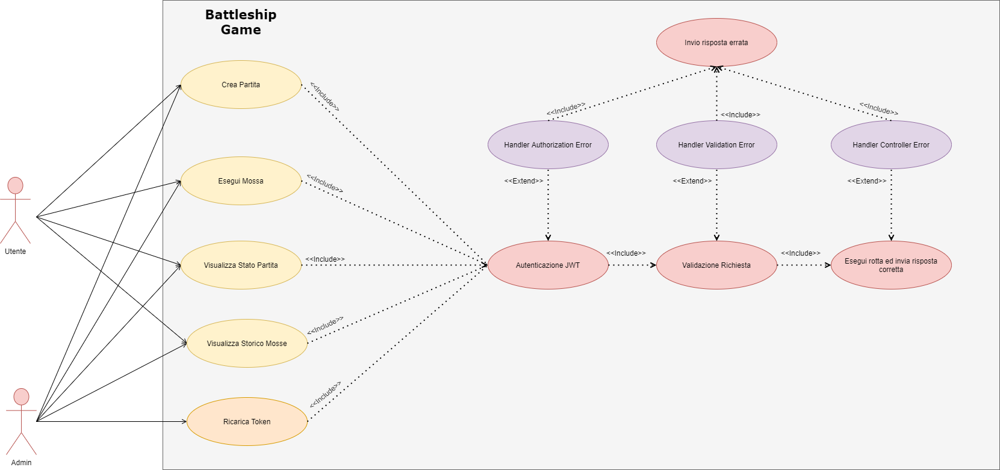

# Progetto-Programmazione-Avanzata: Battleship Game
## Obiettivi del Progetto
L'obiettivo del progetto consiste nella realizzazione di un backend che consente di gestire il gioco della battaglia navale. Il sistema prevede la possibilità di far interagire due utenti (autenticati mediante JWT) o un utente contro l’elaboratore. Ci possono essere più partite attive in un dato momento. Un utente può allo stesso tempo partecipare ad una ed una sola partita. Si può giocare la partita anche in una modalità alternativa (solo nel caso di utente contro utente); si utilizza a tal proposito un parametro silence che corrisponde alla facoltà da parte di un utente di non rispondere se la cella è piena o vuota (silenzio). Tale parametro può avere un valore compreso tra 0 e 5 (estremi inclusi). Ogni volta che un utente esercita tale opzione durante la partita il valore di silence viene decrementato. Se uguale a zero il sistema deve negare la possibilità all’utente di esercitare l’opzione silenzio e viene restituito lo stato della cella (vuoto o pieno). Se l’opzione silenzio è esercitabile allora si registra la mossa ma non viene comunicato lo stato (vuoto o pieno) fino al termine della partita.
In particolare, il sistema ha lo scopo di implementare le seguenti funzionalità.

|     Funzionalità  | Ruolo |
| ------------- | ------------- |
| Creare una nuova partita  | user/admin |
| Eseguire una nuova mossa in una partita  |  user/admin |
| Visualizza lo stato di una partita  | user/admin |
| Visualizza lo storico delle mosse in formato CSV | user/admin  |
| Ricarica token all'utente  | admin  |

## Diagrammi UML
### Diagrammi dei casi d'uso

### Diagrammi delle sequenze
#### Creare un nuovo game

